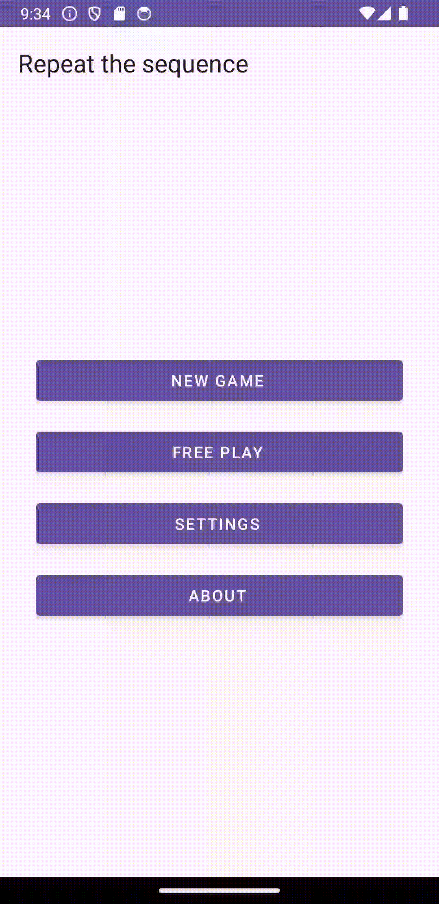
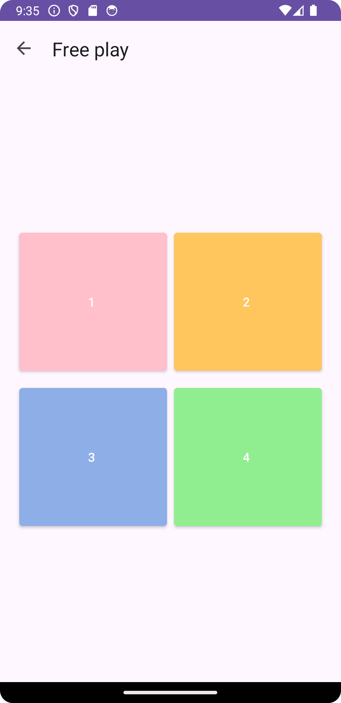
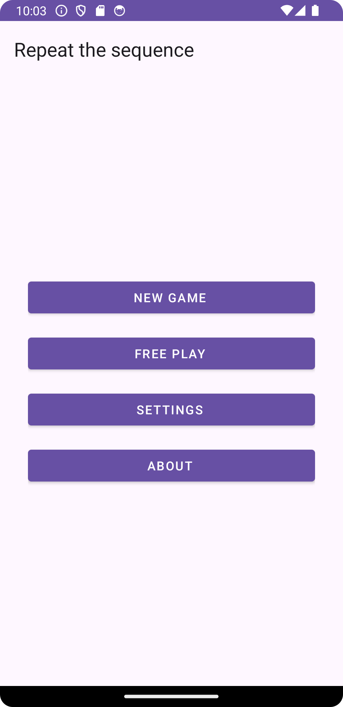
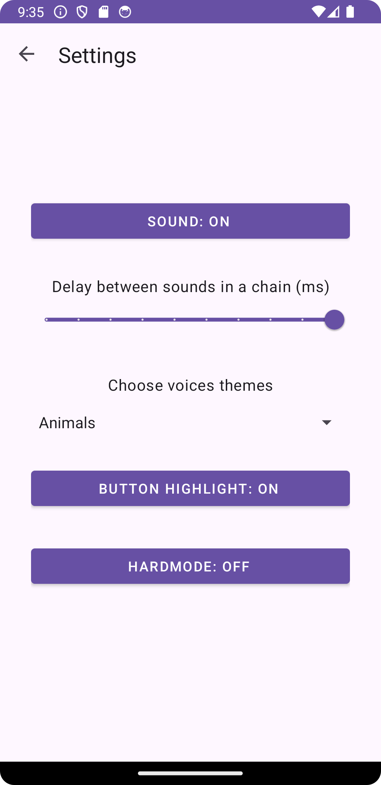
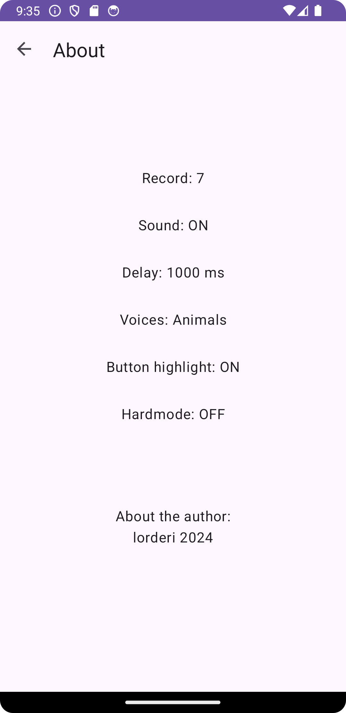

# Android Memory Game

This Android application is a memory game where players must repeat a sequence of sounds played by
the app. The game consists of multiple levels, each adding a new sound to the sequence. The project
is developed using Kotlin and incorporates ViewModel, ViewBinding, and Jetpack Compose for UI
development in a separate branch.

## Technologies Used

- Kotlin
- ViewModel
- ViewBinding
- Jetpack Compose (in development Compose branch)

## Basic Game

- The main screen displays four buttons, each representing a sound.
- The app plays a sequence of sounds with delays, highlighting the corresponding buttons.
- The user must repeat the sequence by pressing the buttons in the same order.
- Levels increase the length of the sequence.
- Incorrectly pressing a button results in a game loss.
- The top result is saved using shared preferences.

  

## Free Play

- Added "Free Play" mode accessible from the menu.
- In Free Play mode, sequences are not played, and there's no level counter.

  

## Menu

- Added a menu with options for "New Game", "Free play", "Settings", "About".

  

- "New Game" launches the main game.
- "Settings" menu item with options for sound toggle, delay adjustment, disable/enable button
  highlight effect during gameplay, ability to change sound themes in settings.
- Sound can be turned on/off.
- Delay between sounds can be adjusted using a slider.

  

- "About" displays information about the game and the author.

  

## Branches

- **master**: Contains the main game logic and UI using ViewBinding.
- **compose**: In development, uses Jetpack Compose for UI development.
